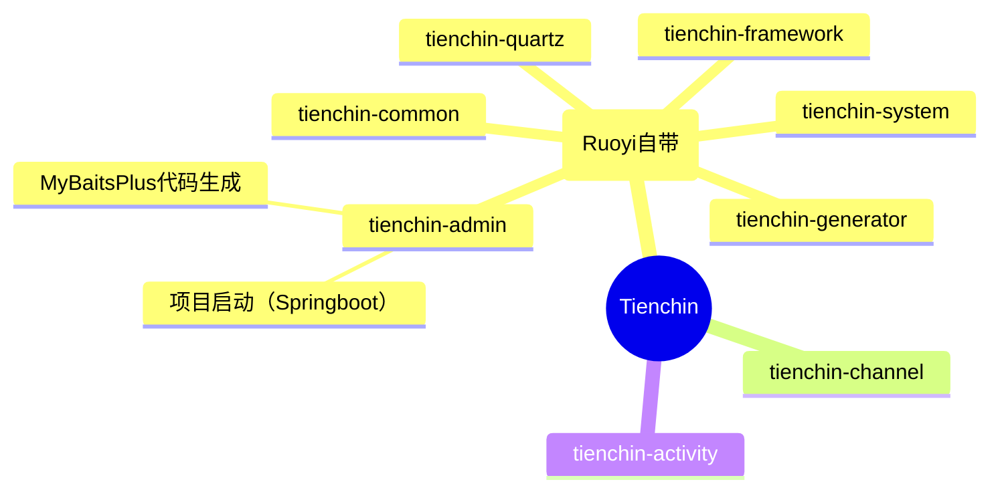
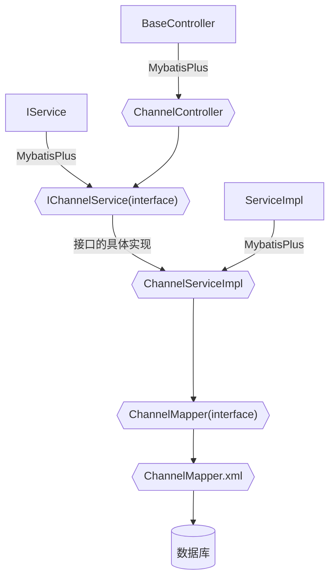
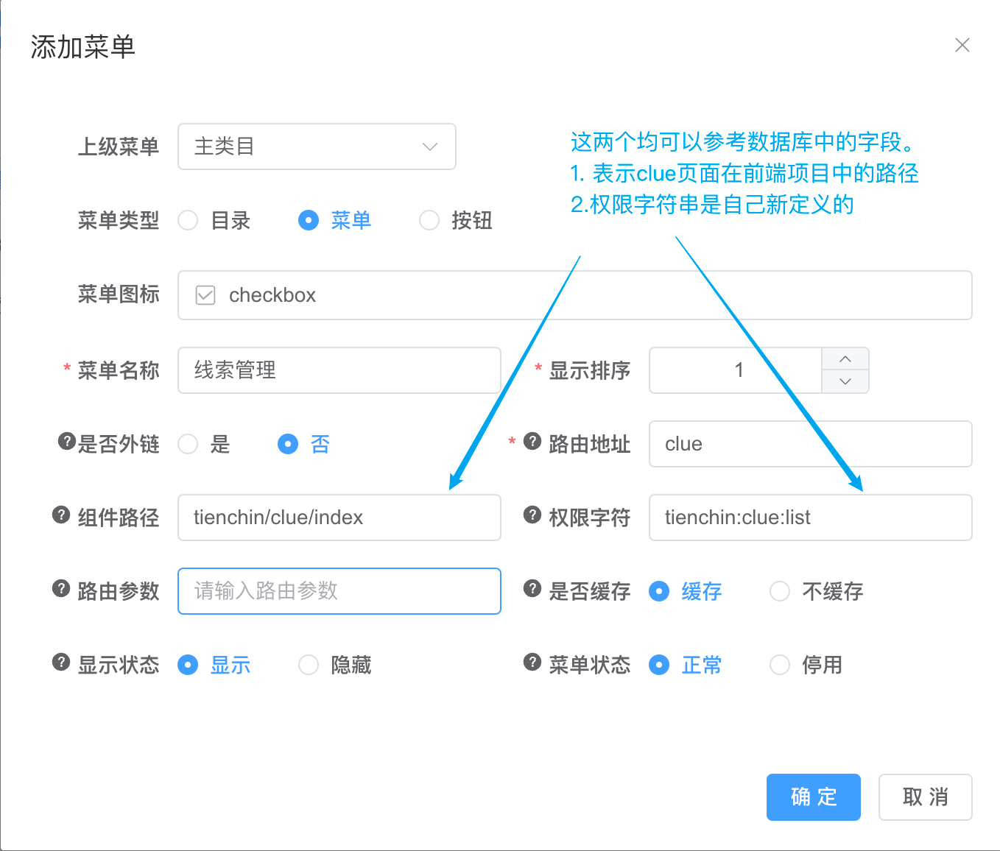
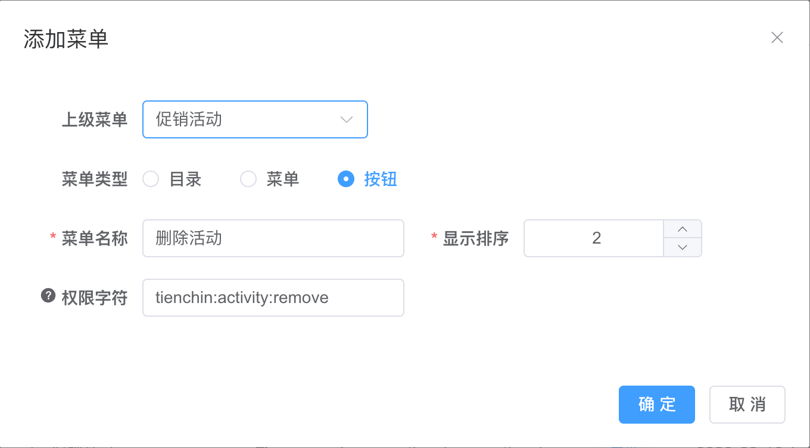
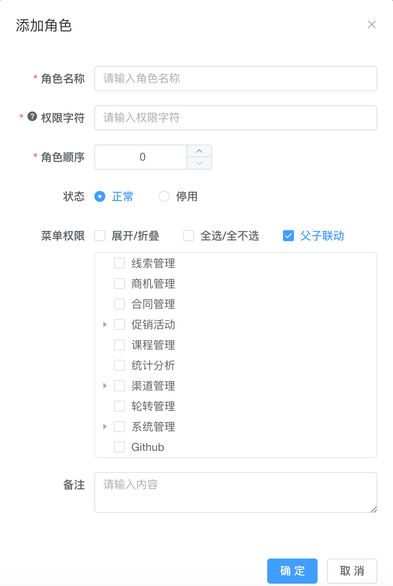
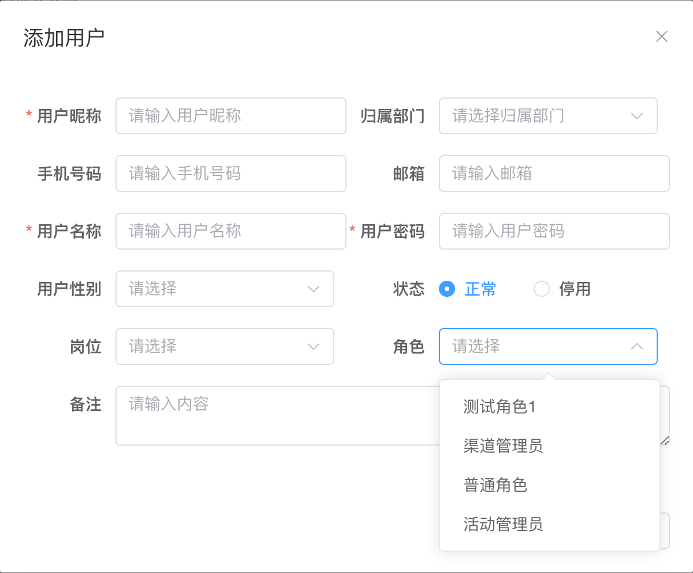
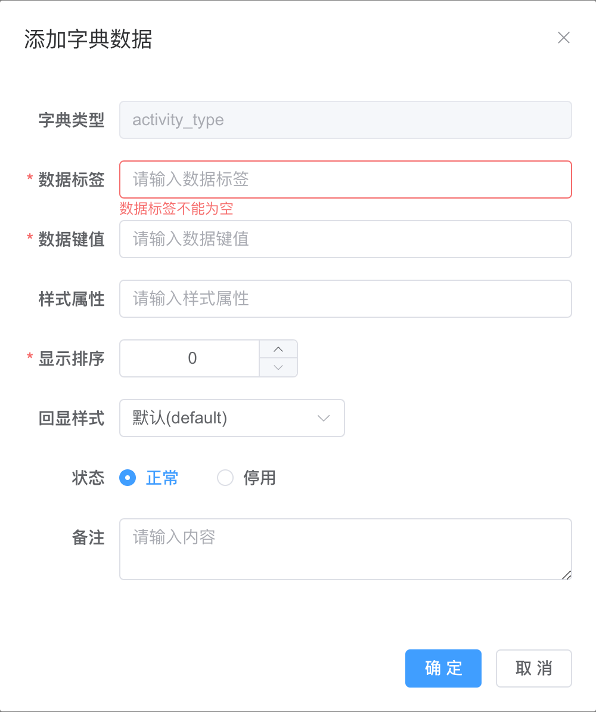
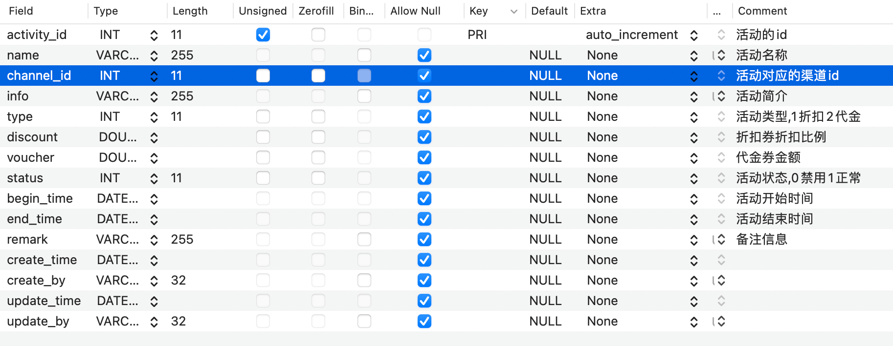
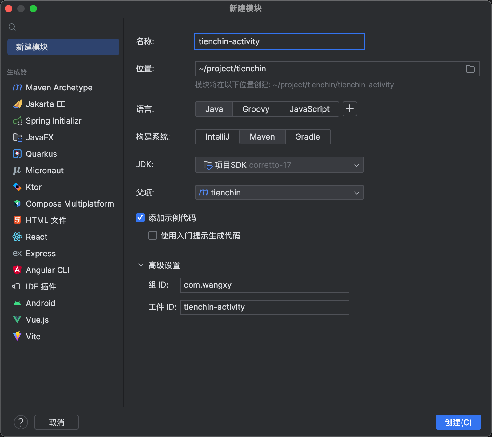

# 待处理

- [ ] channel的更新操作，修改了时间格式（删掉了T。微微处理了，但没验证是否正确）
- [ ] 对于活动的添加等操作，后端并没有验证channnelId是否存在（或者说这个活动是否被逻辑删除了）
- [x] 活动状态，有可能是未开始。
- [ ] BaseEntity中的JsonFormat不生效问题，导致了从后端获取然后更新提交到后端导致的时间格式无法转换问题
- [x] 活动页面渠道信息未验证（比如渠道已经逻辑删除了，但对应活动却没有处理，可以连带活动一起删掉；或者判断还有没有对应活动，没有才让删；或者本demo采用的活动不删但不返回前端）

# 系统结构



# 导入MyBatisPlus

+ 最好装上IDEA插件--MybatisX。会方便很多

> RuoYi使用的是MyBatis。如果使用MBP可能会有一些功能失效。此处选择MBP是因为简单，且遇到问题的时候再用MyBatis。需要注意mybatis和mybatis-plus的版本（使用的RuoYi中mybatis版本为2.2.2，对应的mybatis-plus不能是3.5.2，应使用3.5.1）

在`com.wangxy.tienchin.framework.config.MyBatisConfig`中修改，改造成mybatis-plus形式，如下

`final MybatisSqlSessionFactoryBean sessionFactory = new MybatisSqlSessionFactoryBean();`

## 生成代码

卸载了admin的test中（自己新建的test，且需要自己添加test依赖）

```xml
<!--mybatisPlus代码生成-->
<dependency>
    <groupId>com.baomidou</groupId>
    <artifactId>mybatis-plus-generator</artifactId>
    <version>3.5.3.1</version>
</dependency>
<!-- 生成时需要freemarker-->
<dependency>
    <groupId>org.springframework.boot</groupId>
    <artifactId>spring-boot-starter-freemarker</artifactId>
    <version>2.7.14-SNAPSHOT</version>
</dependency>
```

> 1. 其他版本（组合）似乎会有问题，没有.dataSourceConfig方法。
>
> 2. mysql高版本驱动使用低版本数据库需要`useSSL=false`
>
> 3. 生成的controller记得改成@RestController。另外Controller都在admin中集中处理。把生成controller的换个位置
> 4. 生成的模型类在entity下，但是application.xml中的mybatis配置是搜索`com.wangxy.**.domain`。故而将entity修改为domain。

## 在MybatisPlus生成代码下的结构（以Channel为例）




+ 需要注意的是：虽然数据库字段是`create_by`但是经过MybatisPlus处理后，前端拿到的数据是`createBy`。即它会进行处理，把下划线转化为大写形式

## Mybatis（Plus）遇到的问题

1. Mybatis不会自动转换下划线式和驼峰式数据库字段。
   + 开启配置即可（mybatis或mybatisplus均可）但需要注意，如果mybatis有专门的配置文件，则需要在专用的配置文件中设置，否则不生效。

2. 遇到`Invalid bound statement (not found): com.wangxy.tienchin.channel.mapper.ChannelMapper.selectList Invalid bound statement (not found): com.wangxy.tienchin.channel.mapper.ChannelMapper.selectList`错误。

3. 调用CRUD接口时遇到：`Invalid bound statement (not found): com.wangxy.tienchin.channel.mapper.ChannelMapper.selectList`

   > https://baomidou.com/pages/f84a74/#出现-invalid-bound-statement-not-found-异常。
   >
   > 不知道为什么命名引入了依赖，但是需要自己`import com.baomidou.mybatisplus.extension.spring.MybatisSqlSessionFactoryBean;`且需要处理红线来引入（可能与之前文档中说的什么`当前包未传递依赖 MP 包，需要自己引入`有关?)

## MybatisPlus相关

1. lambda

# 添加自己的菜单、页面、数据库等

## 添加菜单



然后在前端/views/tienchin/下添加应有的目录以及vue文件即可。他们会通过动态路由自动导入

## 按钮配置



## 添加用户角色

### 添加角色



### 添加用户



## 数据库字段字典

 

上表中添加了一些字段，这些字段使用不同的值来代表不同的状态。Ruoyi提供了这些字段的配置,分别是字典管理和字典数据（字典数据页面从字典管理中进入）

## 添加数据库



## 后端模块创建



然后：修改如下几个模块的`pom.xml` ：`tienchin-activity` `tienchin` `tienchin-admin`

## mybatisPlus代码生成

之前写在了`tienchin-admin`的`/test`下。修改一点运行即可。

**Controller的注解：修改为`@ResController`，以及@RequestMapping的路径修改为tienchin/xxx**

`Controller extends BaseController`

移动生成的`controller`到`tienchin-admin`下。

修改`entity`为`domain`使得项目整体是统一的（且和mybatis配置有关系）

如果需要vo，则`vo extends BaseEntity`。且有些字段不需要再额外定义

---

以上。就可以开始开发一个页面了

# 模型类使用统一的校验配置文件

+ 新建`resources/ValidationMessages.properties`文件（名字不能随意变。由`LocalValidatorFactoryBean`来完成默认名，但我没搜到此类）。

+ 定义格式如下

  ```properties
  # 不用必须对应domain，只是为了方便辨认
  channel.name.notnull=渠道名称不能为空呢
  # domain模型类
  @NotBlank(message = "{channel.name.notnull}")
  private String channelName;
  ```

  

## RuoYi使用中遇到的小Bug记录

1. 添加菜单时，点击《路由参数》后未填写任何东西。添加后导致系统崩溃。在mysql/tienchin.sys_menu/的`query`字段是空 而不是 NULL（正常添加应该为NULL）

   > 未经过严格测试，只是遇到了此状况记录了一下。

2. 

