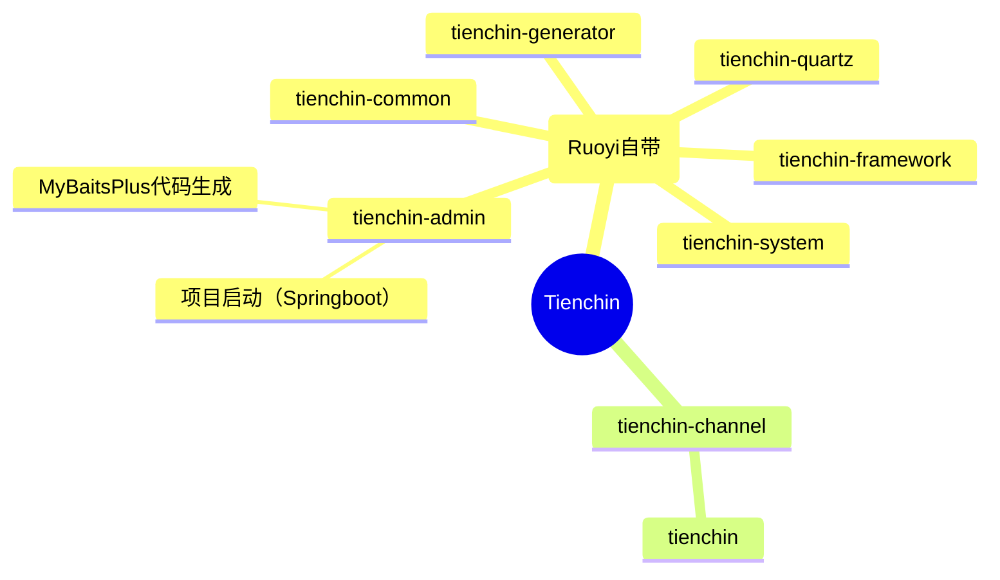

# 系统结构




# 真正的业务

## 添加自己的页面


然后在前端/views/tienchin/下添加应有的目录以及vue文件即可。他们会通过动态路由自动导入

## 导入MyBatisPlus

> RuoYi使用的是MyBatis。如果使用MBP可能会有一些功能失效。此处选择MBP是因为简单，且遇到问题的时候再用MyBatis。需要注意mybatis和mybatis-plus的版本（使用的RuoYi中mybatis版本为2.2.2，对应的mybatis-plus不能是3.5.2，应使用3.5.1）

在`com.wangxy.tienchin.framework.config.MyBatisConfig`中修改，改造成mybatis-plus形式，如下

`final MybatisSqlSessionFactoryBean sessionFactory = new MybatisSqlSessionFactoryBean();`

## 生成代码

卸载了admin的test中（自己新建的test，且需要自己添加test依赖）

```xml
<!--mybatisPlus代码生成-->
<dependency>
    <groupId>com.baomidou</groupId>
    <artifactId>mybatis-plus-generator</artifactId>
    <version>3.5.3.1</version>
</dependency>
<!-- 生成时需要freemarker-->
<dependency>
    <groupId>org.springframework.boot</groupId>
    <artifactId>spring-boot-starter-freemarker</artifactId>
    <version>2.7.14-SNAPSHOT</version>
</dependency>
```

> 其他版本（组合）似乎会有问题，没有.dataSourceConfig方法。
>
> mysql高版本驱动使用低版本数据库需要`useSSL=false`
>
> 生成的controller记得改成@RestController。另外Controller都在admin中集中处理。把生成controller的换个位置

## 线索

## 渠道


## 数据库字段字典

上表中添加了一些字段，这些字段使用不同的值来代表不同的状态。Ruoyi提供了这些字段的配置。分别是字典管理和字典数据（字典数据页面从字典管理中进入）。从这里可以直接添加字段

## 用

# RuoYi使用中遇到的小Bug记录

1. 添加菜单时，点击《路由参数》后未填写任何东西。添加后导致系统崩溃。在mysql/tienchin.sys_menu/的`query`字段是空 而不是 NULL（正常添加应该为NULL）

   > 未经过严格测试，只是遇到了此状况记录了一下。

