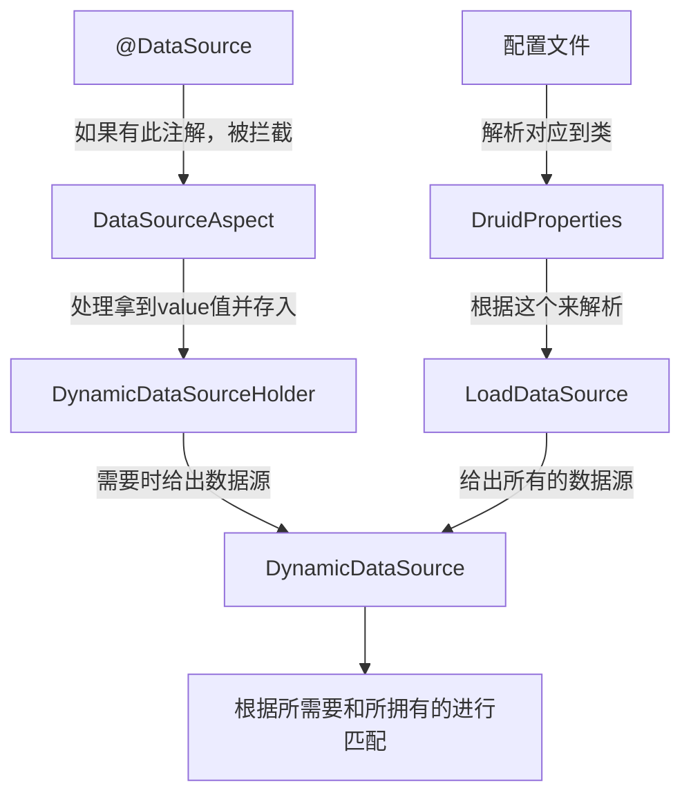
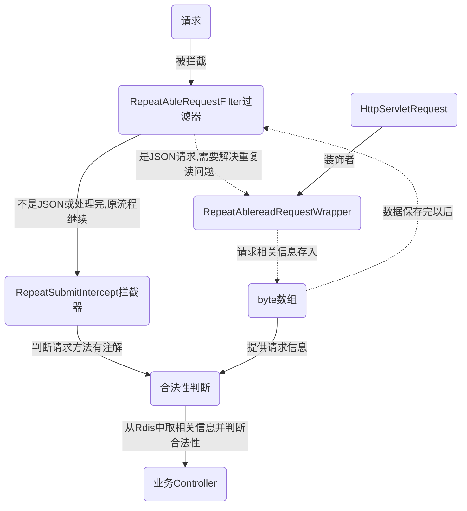
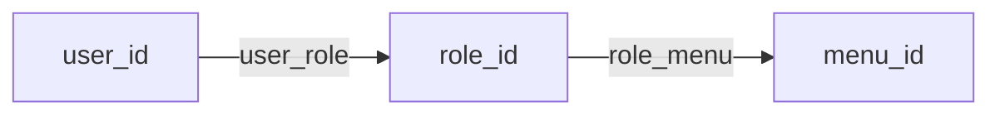
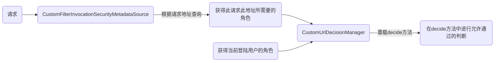

# 后端相关问题

# 前端相关问题

### npm run dev


每次都需要:`export NODE_OPTIONS=--openssl-legacy-provider`后再`npm run dev`

### 图片和base64的转化

[图片和base64互转](https://tool.jisuapi.com/pic2base64.html)

# 项目初始化

### format code

注意filter java类型的。其他类型的动了容易出问题

### 项目全局替换

1. 包名: com.ruoyi => com.wangxy.teinchin
1. com.ruoyi => com.wangxy
1. 版本号: 3.8.6 => 0.0.1
1. ruoyi => teinchin
1. 若依 => 天勤
1. 模块名：rename and directory
1. 项目名
1. com.wangxy.framework.config.CaptchaConfig 中修改KaptchaTextCreator地址
1. common 中 config 的ruoyiconfig => teinchinconfig
1. 重新打开项目
1. 前端 src/utils/ruoyi.js => teinchin.js
1. src/assets/styles/ruoyi.scss => teinchin.scss

### SpringBoot 启动字符图

./admin/resources/banner.txt 可在[bootschool](https://bootschool.net/ascii)生成

# RuoYi脚手架结构分析

```
com.ruoyi     
├── common            // 工具类
│       └── annotation                    // 自定义注解
│       └── config                        // 全局配置
│       └── constant                      // 通用常量
│       └── core                          // 核心控制
│       └── enums                         // 通用枚举
│       └── exception                     // 通用异常
│       └── json                          // JSON数据处理
│       └── utils                         // 通用类处理
│       └── xss                           // XSS过滤处理
├── framework         // 框架核心
│       └── aspectj                       // 注解实现
│       └── config                        // 系统配置
│       └── datasource                    // 数据权限
│       └── interceptor                   // 拦截器
│       └── manager                       // 异步处理
│       └── shiro                         // 权限控制
│       └── web                           // 前端控制
├── ruoyi-generator   // 代码生成（不用可移除）
├── ruoyi-quartz      // 定时任务（不用可移除）
├── ruoyi-system      // 系统代码
├── ruoyi-admin       // 后台服务
├── ruoyi-xxxxxx      // 其他模块
```

不是微服务结构，但这种结构相对易于转换为微服务结构

1. common：最底层，提供公共工具
2. Framework：作配置
3. 其他模块：业务模块
    1. system：系统模块
    2. generator：代码生成（系统工具-代码生成功能）
    3. quartz：定时任务
    4. admin：项目统一的入口，所有的eCOntroller在此处。最顶层依赖其他的模块来完成处理

---

## 全局异常处理

com.wangxy.teinchin.framework.web.exception.GlobalExceptionHandler

## 身份认证

没有使用Session使用，但类似。

### 生成验证码

开源项目：[Captcha](https://github.com/penggle/kaptcha)

#### 流程

1. 请求验证/captchaImage
2. 生成验证码图片，并用verifyKey把结果存储到Redis
3. 返回uuid（项目未使用session）以及base64形式的图片

---

#### 相关类

com.wangxy.teinchin.web.controller.common.CaptchaController

com.wangxy.teinchin.framework.config.CaptchaConfig 相关配置并生成

com.wangxy.teinchin.framework.config.KaptchaTextCreator 生成数学式

### 登陆

#### 流程

1. 携带uuid、账号密码请求/login

2. 按序进行：验证码校验、登陆前置校验、用户验证（不通过则抛出异常并日志）

    1. 从redis中取出对应验证码的结果（可能过期）并判断
    2. 自己写的校验（也可以通过security配置）
    3. security认证，自己用uuid生成token

3. 返回token（实际是就是新随机的uuid）

   jwt格式的字符串，以.区分为三部分。第一部分是算法名、第二部分是核心信息（包含token）、第三部分加密后的用于校验

   Redis中key的形式里含有token（login_tokens:
   cd470e9b-319f-4eb4-8556-ded229b9acf1），value存储用户相关信息。前端可以从jwt第二部分解码（实际不一定需要解）拿到token，且所有请求都需要带上jwt字串

#### 相关类

com.wangxy.teinchin.web.controller.system.SysLoginController

com.wangxy.teinchin.framework.web.service.SysLoginService

### JWT校验

#### 流程

1. 请求带上jwt字串
2. 从请求头中获得登陆用户（Authorization后的内容，jwt解密得到uuid。并拼接成Redis中的key来查询获得用户对象）
3. 验证用户是否过期（用expiretime减currenttime，不足20分刷新redis重设过期时间）。并把用户信息存到SecurityContextHolder中（请求处理完毕之前就可以从这里拿到，响应后清除）后续Security继续进行身份校验（之前出问题也不用处理，Security会处理）

#### 相关类

com.wangxy.teinchin.framework.security.filter.JwtAuthenticationTokenFilter

com.wangxy.teinchin.framework.web.service.TokenService

### Security配置

@EnableGlobalMethodSecurity(prePostEnabled = true, securedEnabled = true)
开启权限注解。两个true分别表示开启@PreAuthorize、@PostAuthorize。之前的vhr用的是动态地址匹配的（更灵活）。这里每个接口的权限都写死了才使用注解。

基础配置，以及上面JWT的校验过滤器，CORS过滤器

#### 相关类

com.wangxy.teinchin.framework.config.SecurityConfig

## 多数据源注解

[参见RuoYiLearnDemo/datasources]()

com.wangxy.teinchin.common.annotation.DataScope 自定义注解

com.wangxy.teinchin.framework.aspectj.DataScopeAspect 使用注解

**@Target**用来定义你的注解将应用于什么地方(例如是一个方法或者一个域)。

**@ Retention**用来定义该注解在哪一个级别可用，可以用来修饰注解，是注解的注解。**生命周期长度 \**RUNTIME > CLASS >
SOURCE\****

---

### 设计思路

可参考[多数据源实现](https://github.com/wangxy98c/RuoyiLearnDemo/tree/715fa25750da60e173801051adfd9f403b8b10fd/datasources)



*
自定义一个注解，当它加在Service层或类上，表示方法或者类中的所有方法都是用某一个数据源。如果某个方法上有这个注解，将该方法需要使用的数据源名称存入ThreadLocal。将来使用Mybatis获取数据源名称时从ThreadLocal中拿到
    * 自定义切面：在切面中解析@DataSource注解。将标记的数据源存入ThreadLocal
    * Mapper执行时，需要DataSource。自动去AbstractRoutingDataSource类中查找需要的数据源，我们只需要从中返回ThreadLocal即可

与Demo不同的是，他的DynamicDataSource没有使用@Bean，而是采用了DruidConfig，且在他里面写死了配置文件的master和slave。这也是不能有更多数据源的原因

### 网页上修改数据源

由上面的流程可知，我们修改数据源时，修改存入DynamicDataSourceContextHolder的源即可。需要注意的是，两个前面的优先级。参见[多数据源实现](https://github.com/wangxy98c/RuoyiLearnDemo/tree/715fa25750da60e173801051adfd9f403b8b10fd/datasources)

## 限流注解

自定义注解：利用Redis来实现。每次请求都会通过IP以及接口拼接的字符串作为key。到Redis中查询。根据查询结果的数值来判断是否超出了窗口阈值。（使用了LUA脚本）

参见[RuoYi限流实现](https://github.com/wangxy98c/RuoyiLearnDemo/tree/e836762058516ef8578f45879d65883faf9b3f07/ratelimiter)

## 防止重复提交注解

### 常见思路

1. Token机制实现

    1. 客户端请求服务端时获取一个token，每次请求都获得一个全新的token（有超时时间）。Token存入Reids中，并将Token返回给客户端
    2. 客户端携带此Token去请求一个接口
    3. 服务端收到请求后：
        1. 如果Token在Redis中，直接删除该Token并处理业务请求
        2. 如果Token不在，说明Token过期或者已经执行过这个业务了

   优势在于实现简单，劣势在于多了一次获取Token的过程，在高并发下会成为瓶颈。另外就是可能有同时两个进入请求，需要使用LUA维持原子性

    2. Mysql去重表：利用Mysql的唯一索引机制来实现

        1. 客户端请求服务端，服务端将请求信息存入mysql去重表。并根据这次请求的特殊字段（唯一）建立唯一索引（或主键索引）
        2. 判断是否插入成功
           1. 成功：继续完成业务
           2. 失败：表示业务执行过了

   存在问题：Mysql的容错性会影响业务，高并发环境下效率低

3. Redis的setnx：

    1. 客户端请求服务端，服务端将能代表本次请求唯一性的字段通过setnx方式存入Redis并设置超时时间
    2. 判断setnx是否成功（setnx有的话会失败）
        1. 成功：继续业务
        2. 失败：业务已经执行过了

4. 设置状态字段，要处理的数据，设置一个状态字段。

5. 锁：

    1. 乐观锁：数据库中增加版本号字段，每次更新都根据版本号判断。

       ```mysql
       select version from  xxx where id =xxx
       update xxx set xxx=xxx where xx=xx and version=xx
       ```

    2. 悲观锁：假设每次拿数据都会被修改，直接上排它锁。

       ```MySQL
       start; #开启事务
       select * from xxx where xxx for update;
       update xxx;
       commit; #提交事务
       ```

---

### RuoYi实现的思路（不同于以上四种）

[参见submitrepeat](https://github.com/wangxy98c/RuoyiLearnDemo/tree/99afece18efa57d7993112ad55121bf49d1555c6/submitrepeat)

1. 使用拦截器拦截解释repeatsubmit注解。
2. 判断是否是重复提交
    1. 用请求信息生成RedisKey值，并从中查询
    2. 判断是否符合要求（时间要求、请求接口）
    3. 进行响应的处理
    3.
    需要注意的是：需要先解决Request重复读取的问题（用过滤器判断是否是JSON信息，并用byte数组存储下来，需要的时候再取出使用。使用到了装饰者模式来装饰HttpServletRequest）。不解决此问题会导致第二次（一般在Controller里)
    使用RequestBody内容出错



## 数据权限注解

[参见demo-datascope](https://github.com/wangxy98c/RuoyiLearnDemo/tree/b25c1df057c8a518416d124cd258b08eef39f9b2/datascope)

SpringSecurity 通过PostFilter注解：数据全部从sql中查出来，查出来以后再过滤。这样会导致效率较低

### RuoYi思路

mapper的SQL语句写好基础的语句后，通过对不同data_scope的不同生成相应的字符串**拼接到SQL后面**
来完成数据过滤。（最终的查询字符串主要是`select xx  in (select xx)`形式 ）

## 日志注解

com.wangxy.teinchin.framework.aspectj.LogAspect  切面（核心代码）

com.wangxy.teinchin.framework.manager.AsyncManager 异步管理类，日志插入数据库时使用。（使用了定时任务，线程池相关知识）

com.wangxy.teinchin.framework.config.ThreadPoolConfig

### Aware接口

Spring容器中所有的Bean对于Spring容器的存在是没有感知的（不知道容器的存在）。它们之间是松耦合的，可以把Spring容器切换成其它容器（实际几乎不会这么做）。

有时我们需要让Bean能够感知到Spring容器的存在，这样才能从中拿到一些东西。此时就需要用到Aware接口

---

## 自定义注解和Aop总结

### AOP

+ 前置通知：目标方法执行之前
+ 后置通知：目标方法执行之前
+ 异常通知：目标方法抛出异常时
+ 返回通知：目标方法有返回值的时候
+ 环绕通知：包含了上面的四种情况

实际项目中的应用：更多是通过自定义注解+AOP解决各种问题

1. 事务处理（底层是AOP）
2. 接口限流的处理：前置通知，方法执行前统计时间窗口内被调用过多少次，如果超过就禁止执行
3. 接口幂等性（重复提交）的处理：（demo使用了拦截器，但也可以AOP）通过前置通知，方法执行前先取统计当前在规定时间内是否执行过，如果执行过就拒绝执行
4. 多数据源切换：通过前置通知，目标方法执行之前切换系统的数据源
5. 日志记录：后置通知和异常通知
6. 数据权限（过滤）的处理：通过前置通知，方法执行前添加Sql条件。这些条件最终会添加到SQL语句中来实现数据过滤
7. JdbcTemplate（底层是AOP），以及各中 XXXTemplate基本都是AOP实现

### AOP原理

AOP就是基于**动态代理**的，但动态代理有两种实现方式

1. 基于JDK的动态代理：要求被代理对象要有接口
2. 基于CGLIB的动态代理：不需要有接口

+ 在Spring中：如果被代理对象有接口，默认使用JDK动态代理。否则使用CGLIB
+ 在SpringBoot中：
  + 2.0之前（不含2.0）：和在Spring中一样默认使用JDK动态代理
    + 如果`spring.aop.proxy-target-class`为`true`。那么即便对于有接口的对象也会使用CGLIB动态代理
  + 2.0之后：默认情况下使用CGLIB动态代理，无论是否有接口。配置`spring.aop.proxy-target-class=false`即可开启

## RuoYi细化到按钮级别的权限管理

实现思路类似于Vhr的动态菜单栏（vhr理论上可以无限层级）

Ruoyi的实现，在数据库表sys_menu中的menu_type分三级：

1. M表示是一个目录
2. C表示是一个菜单项
3. F表示是一个按钮



RuoYi使用了LoginUser类来实现UserDetails。但它的getAuthorities返回的为空（因为它的**权限判断实际上自己比对的，压根没调用此方法**。`@PreAuthorize("@ss.hasPermi('system:menu:list')")`的含义是找到名为`ss`的Bean并调用`hasPermi`方法，返回的结果（通过menu表中的perms字段切割后的要求进行判断）即此注解是否放行）

其中`@PreAuthorize("@ss.hasPermi('system:menu:list')")`的SPringExpressionLanguage作用及使用方法可[参见demo-sepl](https://github.com/wangxy98c/RuoyiLearnDemo/tree/8a7992a184ec10b4108d52193f61f0d991a6b39f/springexpressionlanguage)

### 权限中的概念树梳理

Permission是一个个具体的权限，例如添加、删除用户。多个操作权限合并在一起就是一个角色Role

+ Shiro中，要控制权限时，框架本身就有Role和Permission

+ 但是在SpringSecurity中并没有明确的Role和Permission
  + 当前用户类，要实现UserDetails接口，在这个接口中。如果要返回用户角色/权限的话，调用getAuthorities方法。此时这个方法到底是返回Role还是Permission呢？
    + 其实无所谓。返回Role或Permission都可以。
    + 但由于角色是权限的集合（权限粒度更细），我们可以拿着用户的角色去查询用户权限。所以返回权限更合理一些
    + 在Security中，创建一个用户时，给用户设置角色还是权限，最终都调用同一个方法。只是如果是角色的话，多了一个`ROLE_`前缀而已（这也是Security要求必须带ROLE_前缀的理由吧）

### Security权限管理

#### vhr中的权限管理

[参见vhr-Config](https://github.com/wangxy98c/vhr/tree/e35dbbdf20730dda9cc71f80c2f97af2d3e6f439/vhr/src/main/java/org/javaboy/vhr/config)



#### Ruoyi

需要进行权限限制的方法上使用`@PreAuthorize("hasPermission('/add','sys:user:add')")`注解（注意要开启：`@EnableGlobalMethodSecurity(prePostEnabled = true)`）。我们需要自己实现权限评估器。

+ RuoYi框架是自己注册了一个Bean(`ss.hasPeri()`)，然后使用了里面的方法。但**不是在Security（SecurityExpressionRoot）的基础上进行扩展**。


## RuoYi权限改造

1. 复制Demo中的Handler和Root到Tienchin。并在com.wangxy.teinchin.framework.config.ResourcesConfig中注册Handler。**注意不是SecurityConfig中**

2. 全局替换hasPermission为hasPermission

3. 改造LoginUser implement UserDetials中的getAuthorities()

4. 这些完成后**仍会遇到问题**（不是@PreAuthorities权限的问题，而是登陆认证问题）。请求会返回

   `"msg": "请求访问：/system/role/list，认证失败，无法访问系统资源","code": 401`

​		修复方法：在LoginUser的getAuthoritis上加`@JSONField(serialize = false)`

​		区别在于：加了注解后的getAuthorities的输出结果是
