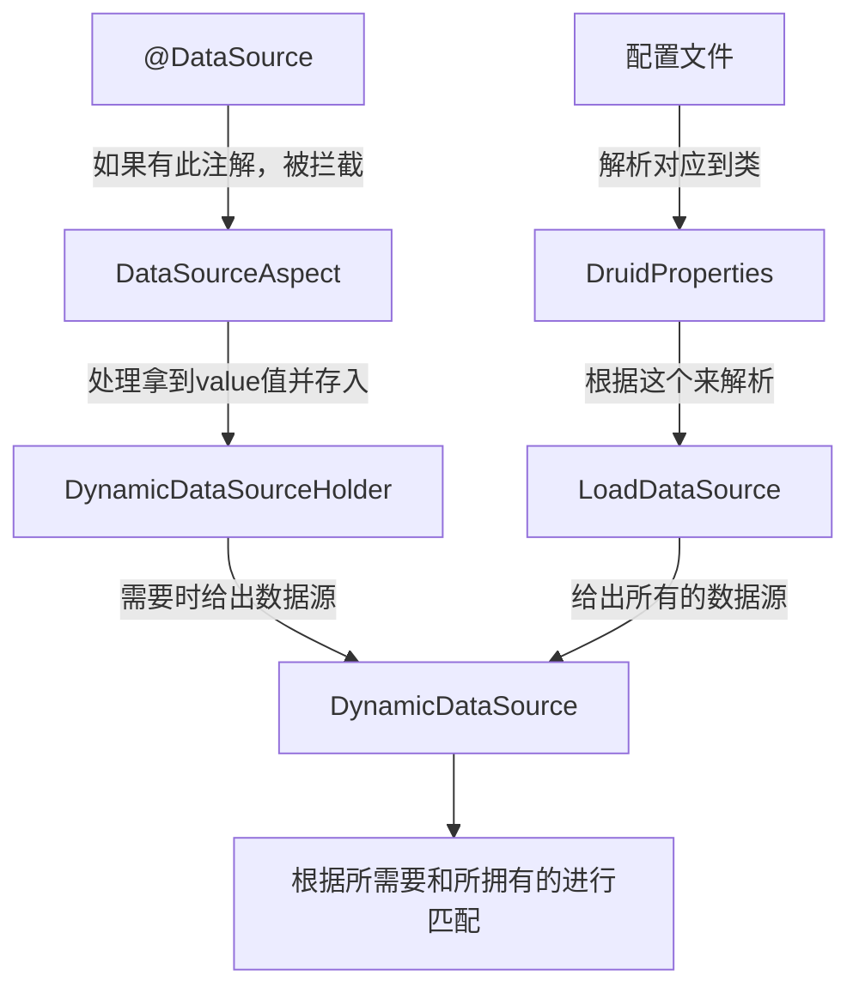
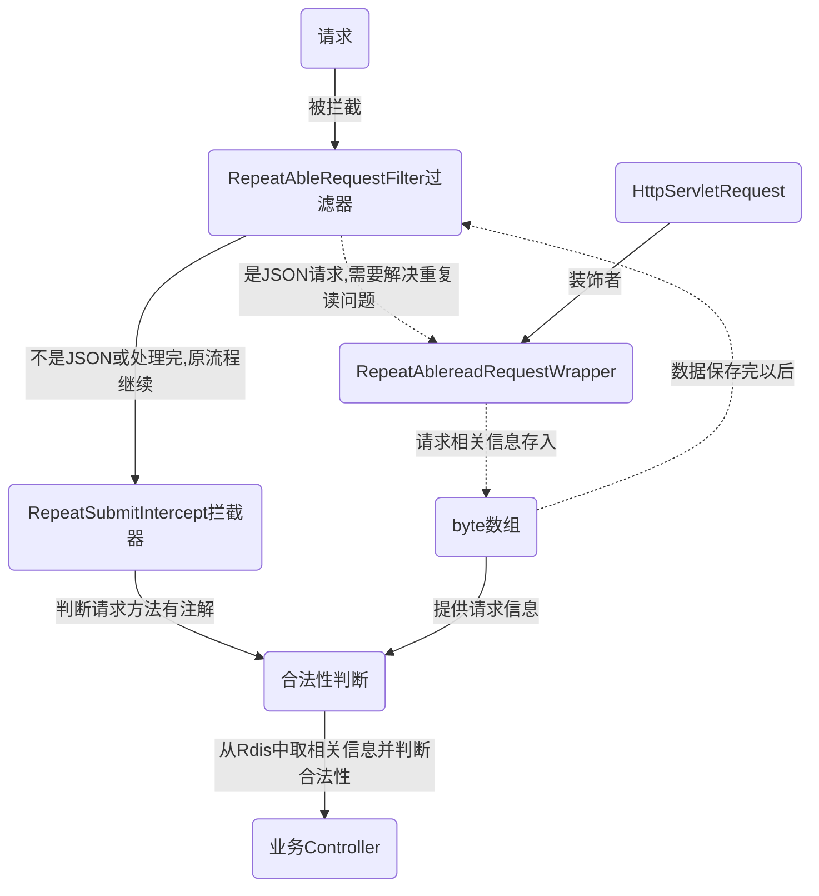
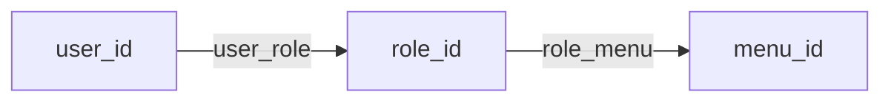
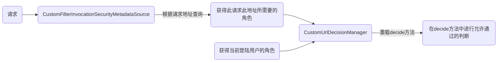
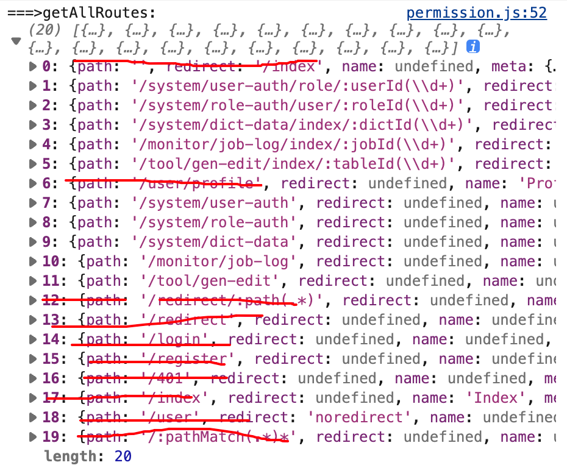
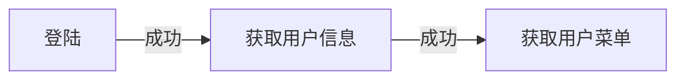

# 后端相关问题

# 前端相关问题

### npm run dev

某个版本的RuoYi-ui会出现此问题（此学习项目现在使用的版本不会出现）


每次都需要:`export NODE_OPTIONS=--openssl-legacy-provider`后再`npm run dev`

### 图片和base64的转化

[图片和base64互转](https://tool.jisuapi.com/pic2base64.html)

### 一个语法： ...

```javascript
this.onlyOneChild = {...parent, path: '', noShowingChildren: true}
//表示把parent展开（parent里有很多属性）
```

## Promise

参见[PromiseTest]()

Promise执行成功就将resolve抛出，失败用reject。只管抛出结果即可。

### then方法

then其实可以传递两个参数，第一个是成功的回调函数，第二个是失败的回调函数。如果没有传递第二个可以在catch中处理失败。

then的返回值有三种：

1. Promise：下一个then的主语其实就是返回的这个Promiese

2. 字符串：返回一个字符串，**此时可以一直then下去**，所有的then都是同一个主语

   + 成功与否条件根据Promise，但data是return的字符串

   ```javascript
   new Promise(login).then(data=>{
       console.log('then1:',data)
       return data+'1';
   }).then(data=>{
       console.log('then2:',data)
       return data+'2'
   }).then(data=>{
       console.log('then3:',data)
       return data+'3'
   }).catch(err=>{
       console.log('error:',err)
       return err+'4'
   })
   //一个成功的测试输出
   // login===>  0.759378843878912
   // then1: login success
   // then2: login success1
   // then3: login success12
   //一个失败的测试输出
   // login===>  0.33134505946441895
   // error: login error
   ```

3. 异常：抛出异常后即立刻转入失败的catch

   ```javascript
   new Promise(login).then(data=>{
       console.log('then1:',data)
       return data+'1';
   }).then(data=>{
       console.log('then2:',data)
       throw new Error('出错了2')
   }).then(data=>{
       console.log('then3:',data)
   }).catch(err=>{
       console.log('error:',err)
   }).finally(()=>{
       console.log('执行finally')
   }).then(()=>{
       console.log('finally 后面的then 代码')
   })
   //一个测试
   // login===>  0.5963416081378934
   // then1: login success
   // then2: login success1
   // error: Error: 出错了2
   //     at /Users/wangxy/code/RuoyiLearnDemo/SomethingTest/PromiseT.js:103:11
   //     at process.processTicksAndRejections (node:internal/process/task_queues:95:5)
   // 执行finally
   // finally 后面的then 代码
   ```

### catch方法

不是必须的，也可以直接在then中写两个回调函数，第二个回调函数就是用来处理catch情况的。不过大多数情况下都是单独写出来

进入catch的情况

1. Promise中通过reject返回
2. then中抛出异常

+ 进入catch都是进入最近的一个，不会一直进入（then的话是会一直往后进入）

### finally方法

和java中类似，出错也会执行finally代码。**但是finally执行完之后还可以继续then**

### 静态方法

1. Promise.resolve()：返回一个带给定值解析后的Promise对象，此对象只会进入then

2. Promise.reject()：返回的对象只会进入catch

   ```javascript
   let p1=Promise.resolve('成功了！')//只会进入then
   p1.then(data=>{
       console.log('data',data)
   }).catch(err=>{
       //除非在then中抛出异常，否则不会进入
   })
   function resolved(){
       console.log('resolved')
   }
   function rejected(err){
       console.log('rejected:',err)
   }
   p1=Promise.reject('出错了!')//只会进入reject
   //p1.then(resolved,rejected) 或如下方式
   p1.then(resolved).catch(rejected)
   ```

   

3. Promise.all()：**接受多个Promise对象**，返回一个Promise实例。所有的Promise都resolve后才会进入then中，**只要有一个返回reject就进入catch**。它能够确保多个任务同时执行成功

   ```javascript
   //let p1=Promise.resolve('resolve1')
   let p1=Promise.reject('reject!')
   //let p2=88
   let p2=Promise.reject('reject2')
   let p3=new Promise((resolve,reject)=>{
       setTimeout(resolve,3000,"hello javaboy")
   })
   Promise.all([p1,p2,p3]).then(data=>{
       //三个都是resolve，会进入then。数据是所有的返回组成的数组
       console.log('data:',data)
       //输出数据：   data: [ 'resolve1', 88, 'hello javaboy' ] 
   }).catch(err=>{
       //只要有一个失败的情况，数据是第一个失败的数据
       console.log('error:',err)
       //输出数据：  error: reject!
   })

4. Promise.race()：接受多个Promise对象，参数中只要有一个执行成功或者失败就可以确定了，**不会等其他执行慢的Promise**。慢的那些Promise会直接被抛弃

   ```javascript
   let p1=new Promise((resolve,reject)=>{
       setTimeout(resolve,100,"one")
   })
   let p2=new Promise((resolve,reject)=>{
       setTimeout(resolve,1000,"two")
   })
   Promise.race([p1,p2]).then(data=>{
       console.log('data:',data)
   }).catch(err=>{
       console.log('err:',err)
   })
   //测试输出,输出非常迅速，不会等10s（two）
   // data: one
   ```


## vue3

### 变量

```javascript
const book=reactive({
  name: '三国演义'
  author: '罗贯中'
})//为了直接使用name和author而不是book.name这种。
const{name,author}=toRefs(book)
```

### 全局方法

利用[插件](https://cn.vuejs.org/guide/reusability/plugins.html)  但不能用this了，一般在频繁使用全局方法的页面使用吧（如果只有少量可以直接import方法）

定义：`const app = createApp(App);app.config.globalProperties.myfunc = myfunc`

引用：

```javascript
import {getCurrentInstance} from 'vue'
const { proxy } = getCurrentInstance();
const { sys_yes_no } = proxy.myfunc("sys_yes_no");
```

### 自定义[插件](https://cn.vuejs.org/guide/reusability/plugins.html)

插件 (Plugins) 是一种能为 Vue 添加全局功能的工具代码。（其实`.use(store).use(router)`都是插件)

```javascript
// ./plugins/index.js
import MyBanner from '@/components/MyBanner' 
export default{
  install:(app,options)=>{
    //插件代码
    console.log("自定义插件-传入的参数是：",options)
    app.component("my-banner",MyBanner)//在插件中使用组件并全局注册
  }
}

//main.js
import plugins from './plugins'
app.use(plugins,参数)//项目启动插件会自动执行
```

app：就是vue对象

options：一个可选参数，可以是各种类型

#### 自定义插件中的provide和inject

通过provide定义一个方法，需要使用的时候通过inject注入这个方法然后使用

```javascript
// plugins/i18n.js
export default {
  install: (app, options) => {
    const clickMe=()=>{
      console.log("clicked me")
    }
    app.provide('clickMe', clickMe)
  }
}
```

```javascript
import { inject } from 'vue'
const clickMe = inject('clickMe')//inject() can only be used inside setup
clickMe()//执行
```


### 自定义[组件component](https://cn.vuejs.org/guide/components/registration.html)

```javascript
import MyBanner from '@/components/MyBanner'//自己写的
//全局挂载
app.component('my-banner', MyBanner)
```

当然也可以在插件中引入组件并注册（全局），参见自定义插件

### [自定义指令](https://cn.vuejs.org/guide/reusability/custom-directives.html)

vhr中的messge.vue中有使用指令(实现自动滚动到底部)，但没有全局挂载等

> 在 `<script setup>` 中，任何以 `v` 开头的驼峰式命名的变量都可以被用作一个自定义指令。在上面的例子中，`vFocus` 即可以在模板中以 `v-focus` 的形式使用。

```vue
<script setup>
// 在模板中启用 v-focus
const vFocus = {
  mounted: (el) => el.focus()
}
</script>

<template>
  <input v-focus />
</template>
```

+ 过 `directives` 选项注册可以通过`app.directive('focus', {  })` 挂载到全局（选项式API即便不挂载全局也要在directive中定义）

> 指令的钩子会传递以下几种参数：

+ `el`：指令绑定到的元素。这可以用于直接操作 DOM。
+ `binding`：一个对象，包含以下属性。(好几种不同的传递方式，如= : )
  + **`value`：传递给指令的值。例如在 `v-my-directive="1 + 1"` 中，值是 `2`**。
  + `oldValue`：之前的值，仅在 `beforeUpdate` 和 `updated` 中可用。无论值是否更改，它都可用。
  + **`arg`：传递给指令的参数 (如果有的话)。例如在 `v-my-directive:foo` 中，参数是 `"foo"`。**
  + `modifiers`：一个包含修饰符的对象 (如果有的话)。例如在 `v-my-directive.foo.bar`中，修饰符对象是 `{ foo: true, bar: true }`。
  + `instance`：使用该指令的组件实例。
  + `dir`：指令的定义对象。
+ `vnode`：代表绑定元素的底层 VNode。
+ `prevNode`：代表之前的渲染中指令所绑定元素的 VNode。仅在 `beforeUpdate` 和 `updated` 钩子中可用。

#### 传递多个参数、动态参数

1. 多个参数：在指令定义里可以正常使用`binding.value  binding.arg`。

​		在使用的地方`<button v-onceClick:s="3"/>`  即`:` 和`=` 一起用就行了。

2. 动态参数：`const dynamicArg=ref('s')`

   `<button v-onceClick:[dynamicArg]="3"/>`

#### 简化形式

对于自定义指令来说，一个很常见的情况是仅仅需要在 `mounted` 和 `updated` 上实现相同的行为，除此之外并不需要其他钩子。这种情况下我们可以直接用一个函数来定义指令

```javascript
<div v-color="color"></div>

app.directive('color', (el, binding) => {
  // 这会在 `mounted` 和 `updated` 时都调用
  el.style.color = binding.value
})
```

#### 在Ruoyi中的应用

```html
<el-button
     type="primary"
     plain
     icon="Plus"
     @click="handleAdd"
     v-hasPermi="['system:dept:add']"
  >新增</el-button>
```

如果具备后面的权限，这个按钮就展示出来。否则隐藏

## Vite

前端构建工具，类似webpack。速度更快

SpringBoot的热加载，提供了两个类加载器

1. baseClassloader：加载第三方类（这些类是不会变的）
2. restartClassloader：加载自己写的类
   + 加载时只需要加载restartClassloader

Vite的思路和SpringBoot热加载基本一致。

1. 依赖：变化很小
2. 源码：经常变化

### 自动导入方法的插件以及其他工具

+ 不需要每个地方都import。它是一个开发工具，上线不需要

1. 安装插件`npm install unplugin-auto-import -D`

2. 配置插件：vite.config.js

   ```javascript
   import AutoImport from 'unplugin-auto-import/vite'
   import VueSetupExtend from 'vite-plugin-vue-setup-extend'
   export default defineConfig({
     plugins: 
     [	 vue(),//默认的vue
        AutoImport({
          imports:['vue','vue-router']
          //凡事vue\vue-router中提供的方法，不需要导入就可以直接使用
          dts:'src/xxx/xxx'//指定代码生成的位置
        }),
        VueSetupExtend()//可以直接在script中定义组件名称
     ]
     resolve:{
     	extensions: ['.vue','.js']//导入文件可以不带这些文件的后缀
   	}
   })
   ```

   一般使用频率很高的组件中的方法可以通过这种方法导入。

> Vite的import导入 默认不能省略'.vue'后缀

>  配置组件名`npm install vite-plugin-vue-setup-extend -D`  
>
> `<script setup name="ComponentName">`


# 项目初始化

### format code

注意filter java类型的。其他类型的动了容易出问题

### 项目全局替换

1. 包名: com.ruoyi => com.wangxy.teinchin
1. com.ruoyi => com.wangxy
1. 版本号: 3.8.6 => 0.0.1
1. ruoyi => teinchin
1. 若依 => 天勤
1. 模块名：rename and directory
1. 项目名
1. com.wangxy.framework.config.CaptchaConfig 中修改KaptchaTextCreator地址
1. common 中 config 的ruoyiconfig => teinchinconfig
1. 重新打开项目
1. 前端 src/utils/ruoyi.js => teinchin.js
1. src/assets/styles/ruoyi.scss => teinchin.scss

### SpringBoot 启动字符图

./admin/resources/banner.txt 可在[bootschool](https://bootschool.net/ascii)生成

# RuoYi脚手架结构分析

```
com.ruoyi     
├── common            // 工具类
│       └── annotation                    // 自定义注解
│       └── config                        // 全局配置
│       └── constant                      // 通用常量
│       └── core                          // 核心控制
│       └── enums                         // 通用枚举
│       └── exception                     // 通用异常
│       └── json                          // JSON数据处理
│       └── utils                         // 通用类处理
│       └── xss                           // XSS过滤处理
├── framework         // 框架核心
│       └── aspectj                       // 注解实现
│       └── config                        // 系统配置
│       └── datasource                    // 数据权限
│       └── interceptor                   // 拦截器
│       └── manager                       // 异步处理
│       └── shiro                         // 权限控制
│       └── web                           // 前端控制
├── ruoyi-generator   // 代码生成（不用可移除）
├── ruoyi-quartz      // 定时任务（不用可移除）
├── ruoyi-system      // 系统代码
├── ruoyi-admin       // 后台服务
├── ruoyi-xxxxxx      // 其他模块
```

不是微服务结构，但这种结构相对易于转换为微服务结构

1. common：最底层，提供公共工具
2. Framework：作配置
3. 其他模块：业务模块
    1. system：系统模块
    2. generator：代码生成（系统工具-代码生成功能）
    3. quartz：定时任务
    4. admin：项目统一的入口，所有的eCOntroller在此处。最顶层依赖其他的模块来完成处理

---

## 全局异常处理

com.wangxy.teinchin.framework.web.exception.GlobalExceptionHandler

## 身份认证

没有使用Session使用，但类似。

### 生成验证码

开源项目：[Captcha](https://github.com/penggle/kaptcha)

#### 流程

1. 请求验证/captchaImage
2. 生成验证码图片，并用verifyKey把结果存储到Redis
3. 返回uuid（项目未使用session）以及base64形式的图片

---

#### 相关类

com.wangxy.teinchin.web.controller.common.CaptchaController

com.wangxy.teinchin.framework.config.CaptchaConfig 相关配置并生成

com.wangxy.teinchin.framework.config.KaptchaTextCreator 生成数学式

### 登陆

#### 流程

1. 携带uuid、账号密码请求/login

2. 按序进行：验证码校验、登陆前置校验、用户验证（不通过则抛出异常并日志）

    1. 从redis中取出对应验证码的结果（可能过期）并判断
    2. 自己写的校验（也可以通过security配置）
    3. security认证，自己用uuid生成token

3. 返回token（实际是就是新随机的uuid）

   jwt格式的字符串，以.区分为三部分。第一部分是算法名、第二部分是核心信息（包含token）、第三部分加密后的用于校验

   Redis中key的形式里含有token（login_tokens:
   cd470e9b-319f-4eb4-8556-ded229b9acf1），value存储用户相关信息。前端可以从jwt第二部分解码（实际不一定需要解）拿到token，且所有请求都需要带上jwt字串

#### 相关类

com.wangxy.teinchin.web.controller.system.SysLoginController

com.wangxy.teinchin.framework.web.service.SysLoginService

### JWT校验

#### 流程

1. 请求带上jwt字串
2. 从请求头中获得登陆用户（Authorization后的内容，jwt解密得到uuid。并拼接成Redis中的key来查询获得用户对象）
3. 验证用户是否过期（用expiretime减currenttime，不足20分刷新redis重设过期时间）。并把用户信息存到SecurityContextHolder中（请求处理完毕之前就可以从这里拿到，响应后清除）后续Security继续进行身份校验（之前出问题也不用处理，Security会处理）

#### 相关类

com.wangxy.teinchin.framework.security.filter.JwtAuthenticationTokenFilter

com.wangxy.teinchin.framework.web.service.TokenService

### Security配置

@EnableGlobalMethodSecurity(prePostEnabled = true, securedEnabled = true)
开启权限注解。两个true分别表示开启@PreAuthorize、@PostAuthorize。之前的vhr用的是动态地址匹配的（更灵活）。这里每个接口的权限都写死了才使用注解。

基础配置，以及上面JWT的校验过滤器，CORS过滤器

#### 相关类

com.wangxy.teinchin.framework.config.SecurityConfig

## 多数据源注解

[参见RuoYiLearnDemo/datasources]()

com.wangxy.teinchin.common.annotation.DataScope 自定义注解

com.wangxy.teinchin.framework.aspectj.DataScopeAspect 使用注解

**@Target**用来定义你的注解将应用于什么地方(例如是一个方法或者一个域)。

**@ Retention**用来定义该注解在哪一个级别可用，可以用来修饰注解，是注解的注解。**生命周期长度 \**RUNTIME > CLASS >
SOURCE\****

---

### 设计思路

可参考[多数据源实现](https://github.com/wangxy98c/TienChinLearnDemo/tree/715fa25750da60e173801051adfd9f403b8b10fd/datasources)



*
自定义一个注解，当它加在Service层或类上，表示方法或者类中的所有方法都是用某一个数据源。如果某个方法上有这个注解，将该方法需要使用的数据源名称存入ThreadLocal。将来使用Mybatis获取数据源名称时从ThreadLocal中拿到
    * 自定义切面：在切面中解析@DataSource注解。将标记的数据源存入ThreadLocal
    * Mapper执行时，需要DataSource。自动去AbstractRoutingDataSource类中查找需要的数据源，我们只需要从中返回ThreadLocal即可

与Demo不同的是，他的DynamicDataSource没有使用@Bean，而是采用了DruidConfig，且在他里面写死了配置文件的master和slave。这也是不能有更多数据源的原因

### 网页上修改数据源

由上面的流程可知，我们修改数据源时，修改存入DynamicDataSourceContextHolder的源即可。需要注意的是，两个前面的优先级。参见[多数据源实现](https://github.com/wangxy98c/TienChinLearnDemo/tree/715fa25750da60e173801051adfd9f403b8b10fd/datasources)

## 限流注解

自定义注解：利用Redis来实现。每次请求都会通过IP以及接口拼接的字符串作为key。到Redis中查询。根据查询结果的数值来判断是否超出了窗口阈值。（使用了LUA脚本）

参见[RuoYi限流实现](https://github.com/wangxy98c/TienChinLearnDemo/tree/e836762058516ef8578f45879d65883faf9b3f07/ratelimiter)

## 防止重复提交注解

### 常见思路

1. Token机制实现

    1. 客户端请求服务端时获取一个token，每次请求都获得一个全新的token（有超时时间）。Token存入Reids中，并将Token返回给客户端
    2. 客户端携带此Token去请求一个接口
    3. 服务端收到请求后：
        1. 如果Token在Redis中，直接删除该Token并处理业务请求
        2. 如果Token不在，说明Token过期或者已经执行过这个业务了

   优势在于实现简单，劣势在于多了一次获取Token的过程，在高并发下会成为瓶颈。另外就是可能有同时两个进入请求，需要使用LUA维持原子性

    2. Mysql去重表：利用Mysql的唯一索引机制来实现

        1. 客户端请求服务端，服务端将请求信息存入mysql去重表。并根据这次请求的特殊字段（唯一）建立唯一索引（或主键索引）
        2. 判断是否插入成功
           1. 成功：继续完成业务
           2. 失败：表示业务执行过了

   存在问题：Mysql的容错性会影响业务，高并发环境下效率低

3. Redis的setnx：

    1. 客户端请求服务端，服务端将能代表本次请求唯一性的字段通过setnx方式存入Redis并设置超时时间
    2. 判断setnx是否成功（setnx有的话会失败）
        1. 成功：继续业务
        2. 失败：业务已经执行过了

4. 设置状态字段，要处理的数据，设置一个状态字段。

5. 锁：

    1. 乐观锁：数据库中增加版本号字段，每次更新都根据版本号判断。

       ```mysql
       select version from  xxx where id =xxx
       update xxx set xxx=xxx where xx=xx and version=xx
       ```

    2. 悲观锁：假设每次拿数据都会被修改，直接上排它锁。

       ```MySQL
       start; #开启事务
       select * from xxx where xxx for update;
       update xxx;
       commit; #提交事务
       ```

---

### RuoYi实现的思路（不同于以上四种）

[参见submitrepeat](https://github.com/wangxy98c/TienChinLearnDemo/tree/99afece18efa57d7993112ad55121bf49d1555c6/submitrepeat)

1. 使用拦截器拦截解释repeatsubmit注解。
2. 判断是否是重复提交
    1. 用请求信息生成RedisKey值，并从中查询
    2. 判断是否符合要求（时间要求、请求接口）
    3. 进行响应的处理
    3.
    需要注意的是：需要先解决Request重复读取的问题（用过滤器判断是否是JSON信息，并用byte数组存储下来，需要的时候再取出使用。使用到了装饰者模式来装饰HttpServletRequest）。不解决此问题会导致第二次（一般在Controller里)
    使用RequestBody内容出错



## 数据权限注解

[参见demo-datascope](https://github.com/wangxy98c/TienChinLearnDemo/tree/b25c1df057c8a518416d124cd258b08eef39f9b2/datascope)

SpringSecurity 通过PostFilter注解：数据全部从sql中查出来，查出来以后再过滤。这样会导致效率较低

### RuoYi思路

mapper的SQL语句写好基础的语句后，通过对不同data_scope的不同生成相应的字符串**拼接到SQL后面**
来完成数据过滤。（最终的查询字符串主要是`select xx  in (select xx)`形式 ）

## 日志注解

com.wangxy.teinchin.framework.aspectj.LogAspect  切面（核心代码）

com.wangxy.teinchin.framework.manager.AsyncManager 异步管理类，日志插入数据库时使用。（使用了定时任务，线程池相关知识）

com.wangxy.teinchin.framework.config.ThreadPoolConfig

### Aware接口

Spring容器中所有的Bean对于Spring容器的存在是没有感知的（不知道容器的存在）。它们之间是松耦合的，可以把Spring容器切换成其它容器（实际几乎不会这么做）。

有时我们需要让Bean能够感知到Spring容器的存在，这样才能从中拿到一些东西。此时就需要用到Aware接口

---

## 自定义注解和Aop总结

### AOP

+ 前置通知：目标方法执行之前
+ 后置通知：目标方法执行之前
+ 异常通知：目标方法抛出异常时
+ 返回通知：目标方法有返回值的时候
+ 环绕通知：包含了上面的四种情况

实际项目中的应用：更多是通过自定义注解+AOP解决各种问题

1. 事务处理（底层是AOP）
2. 接口限流的处理：前置通知，方法执行前统计时间窗口内被调用过多少次，如果超过就禁止执行
3. 接口幂等性（重复提交）的处理：（demo使用了拦截器，但也可以AOP）通过前置通知，方法执行前先取统计当前在规定时间内是否执行过，如果执行过就拒绝执行
4. 多数据源切换：通过前置通知，目标方法执行之前切换系统的数据源
5. 日志记录：后置通知和异常通知
6. 数据权限（过滤）的处理：通过前置通知，方法执行前添加Sql条件。这些条件最终会添加到SQL语句中来实现数据过滤
7. JdbcTemplate（底层是AOP），以及各中 XXXTemplate基本都是AOP实现

### AOP原理

AOP就是基于**动态代理**的，但动态代理有两种实现方式

1. 基于JDK的动态代理：要求被代理对象要有接口
2. 基于CGLIB的动态代理：不需要有接口

+ 在Spring中：如果被代理对象有接口，默认使用JDK动态代理。否则使用CGLIB
+ 在SpringBoot中：
  + 2.0之前（不含2.0）：和在Spring中一样默认使用JDK动态代理
    + 如果`spring.aop.proxy-target-class`为`true`。那么即便对于有接口的对象也会使用CGLIB动态代理
  + 2.0之后：默认情况下使用CGLIB动态代理，无论是否有接口。配置`spring.aop.proxy-target-class=false`即可开启

## RuoYi细化到按钮级别的权限管理

实现思路类似于Vhr的动态菜单栏（vhr理论上可以无限层级）

TienChin的实现，在数据库表sys_menu中的menu_type分三级：

1. M表示是一个目录
2. C表示是一个菜单项
3. F表示是一个按钮



RuoYi使用了LoginUser类来实现UserDetails。但它的getAuthorities返回的为空（因为它的**权限判断实际上自己比对的，压根没调用此方法**。`@PreAuthorize("@ss.hasPermi('system:menu:list')")`的含义是找到名为`ss`的Bean并调用`hasPermi`方法，返回的结果（通过menu表中的perms字段切割后的要求进行判断）即此注解是否放行）

其中`@PreAuthorize("@ss.hasPermi('system:menu:list')")`的SPringExpressionLanguage作用及使用方法可[参见demo-sepl](https://github.com/wangxy98c/TienChinLearnDemo/tree/8a7992a184ec10b4108d52193f61f0d991a6b39f/springexpressionlanguage)

### 权限中的概念树梳理

Permission是一个个具体的权限，例如添加、删除用户。多个操作权限合并在一起就是一个角色Role

+ Shiro中，要控制权限时，框架本身就有Role和Permission

+ 但是在SpringSecurity中并没有明确的Role和Permission
  + 当前用户类，要实现UserDetails接口，在这个接口中。如果要返回用户角色/权限的话，调用getAuthorities方法。此时这个方法到底是返回Role还是Permission呢？
    + 其实无所谓。返回Role或Permission都可以。
    + 但由于角色是权限的集合（权限粒度更细），我们可以拿着用户的角色去查询用户权限。所以返回权限更合理一些
    + 在Security中，创建一个用户时，给用户设置角色还是权限，最终都调用同一个方法。只是如果是角色的话，多了一个`ROLE_`前缀而已（这也是Security要求必须带ROLE_前缀的理由吧）

### Security权限管理

#### vhr中的权限管理

[参见vhr-Config](https://github.com/wangxy98c/vhr/tree/e35dbbdf20730dda9cc71f80c2f97af2d3e6f439/vhr/src/main/java/org/javaboy/vhr/config)



#### TienChin

需要进行权限限制的方法上使用`@PreAuthorize("hasPermission('/add','sys:user:add')")`注解（注意要开启：`@EnableGlobalMethodSecurity(prePostEnabled = true)`）。我们需要自己实现权限评估器。

+ RuoYi框架是自己注册了一个Bean(`ss.hasPeri()`)，然后使用了里面的方法。但**不是在Security（SecurityExpressionRoot）的基础上进行扩展**。


### RuoYi权限改造

1. 复制Demo中的Handler和Root到Tienchin。并在com.wangxy.teinchin.framework.config.ResourcesConfig中注册Handler。**注意不是SecurityConfig中**

2. 全局替换hasPermission为hasPermission

3. 改造LoginUser implement UserDetials中的getAuthorities()

4. 这些完成后**仍会遇到问题**（不是@PreAuthorities权限的问题，而是登陆认证问题）。请求会返回

   `"msg": "请求访问：/system/role/list，认证失败，无法访问系统资源","code": 401`

​		修复方法：在LoginUser的getAuthoritis上加`@JSONField(serialize = false)`

​		区别在于：加了注解后的getAuthorities的输出结果是

## 登陆、鉴权流程梳理

### 登陆流程

1. 登陆请求，直接发送给登陆接口`/login`。方法位于`com.wangxy.teinchin.web.controller.system.SysLoginController#login`
   1. 调用`authenticationManager.authenticate`执行登陆操作。这个操作最终会调用`com.wangxy.teinchin.framework.web.service.UserDetailsServiceImpl#loadUserByUsername`方法进行登陆用户的认证，并返回一个LoginUser（包括根据用户Id从数据库中查询到的用户权限和基本信息）
   2. 创建登陆令牌（实际上是JWT字符串）。
      1. 先生成一个经过处理后的uuid
      2. 以uuid为key。登陆成功的用户LoginUser为value存储到Redis中
      3. 生成一个JWT字符串，这个JWT字符串内容（解析后）只有uuid。

2. 其他请求

   所有需要认证的其他请求都会经过`com.wangxy.teinchin.framework.security.filter.JwtAuthenticationTokenFilter#doFilterInternal`类。它的核心功能是根据JWT字符串去Redis中查询登陆用户对象，并存入`SecurityContextHolder`中。

   1. 携带方式就是将JWT字符串放入到请求头中，不携带不通过
   2. 在`JwtAuthenticationTokenFilter`过滤器中会进行Jwt字符串的处理。根据Jwt字符串解析出当前登陆的用户。具体的获取逻辑在`com.wangxy.teinchin.framework.web.service.TokenService#getLoginUser`中
      1. 先从请求头中提取出JWT
      2. 根据JWT字符串解析并处理得到uuid
      3. 从Redis中查询到用户对象并其它处理（Redis过期时间刷新等）
      4. 最后将登陆用户存储到SecurityContextHolder中（某些服务需要时会取，比如权限的getAuthorities）

### 鉴权流程

1. 用户登陆成功时就已经把用户权限信息保存到了LoginUser中了。每次请求到达的时候，都会在`JwtAuthenticationTokenFilter`过滤器中，重新获取到用户的基本信息（包括权限）存入SecurityContextHolder中（每次请求都是）。

2. 访问某个需要权限控制的接口时，加@PreAuthorize注解即可（过程参见上面）。注解中，会获取到当前用户信息并和需要的角色信息进行比对。

## 动态菜单实现

### 整体思路

不同的人登陆看到的菜单不同，实现思路和vhr思路中一模一样（细节肯定有一些小小的差异）

1. 用户登陆成功之后，前端会自动发送请求到后端查询登陆用户的动态菜单。根据当前登陆成功的用户id去sys_user_role表中查询到这个用户的角色id。然后根据角色id去sys_role_menu表中查询到菜单id。再根据菜单id去sys_menu表中查询到具体的菜单数据
2. 前端定义了一个前置路由导航守卫，页面跳转的时候，路由导航守卫会监听到所有页面跳转。需要动态菜单时就去服务端加载，拿到之后渲染并存入router中。

#### sys_menu表细节

1. is_frame：1表示不是外部链接，会在Teinchin里打开。0表示新建一个标签页打开。

+ 当为0时返回的JSON

```json
{
    "name": "Https://github.com/wangxy98c",
    "path": "https://github.com/wangxy98c",
    "hidden": false,
    "component": "Layout",
    "meta": {
        "title": "TeinChin健身官网",
        "icon": "guide",
        "noCache": false,
        "link": "https://github.com/wangxy98c"
    }
}
```

+ 当为1时返回的JSON

```json
{
    "name": "Tool",
    "path": "/tool",
    "hidden": false,
    "redirect": "noRedirect",
    "component": "Layout",
    "alwaysShow": true,
    "meta": {
        "title": "系统工具",
        "icon": "tool",
        "noCache": false,
        "link": null
    },
    "children": [
        {
            "name": "Build",
            "path": "build",
            "hidden": false,
            "component": "tool/build/index",
            "meta": {
                "title": "表单构建",
                "icon": "build",
                "noCache": false,
                "link": null
            }
        },
        //多个 ，但略去
    ]
}
```

+ 区别主要在于：
  + 是否有children项。（因为需要在当前系统中展示内容，用于Router）
  + ~~component项一个是`Layout`，一个是`InnerLink`~~（老版本才是）

2. menu_type：M表示目录、C表示具体菜单。但有一些特殊情况M、C都可以。
   1. 一个C类型必须有一个parent，如果没有系统就会自动添加一个Layout作为其parent。
   2. M类型没有parent，但此时如果不是外链可能会有一些问题（只渲染自己且点击后填满整个页面）
   3. 且前端在渲染时如果只有一个children则不会渲染parent。

### 服务端

1. 查询菜单

   1. 当前用户是admin，则查询所有菜单（但暂时没有层级关系，需要后续处理）
   2. 不是admin，则根据用户id查询菜单

2. 通过递归操作将菜单的层级关系建立起来

3. com.wangxy.teinchin.system.service.impl.SysMenuServiceImpl#buildMenus **构建菜单**的核心

   1. visiable：可见性

   2. name：一般是path首字母大写。（类型为C、是一级菜单、是系统内页面）时会自动生成一个parent，这个parent的name为空

   3. path：（M-目录、C-菜单）

      1. 不是一级菜单、是一个系统内外链：去掉path中的http或https即可。
      2. 非外链、一级目录、M类型：path在数据库查询到dath前加斜杠/
      3. 非外链、一级目录、C类型：path就是/
      4. 其他情况直接返回菜单项即可

      + 对于正常菜单数据而言，parent实际上走第二个if。children实际上不会进入任何分支直接返回

   4. component：

      1. 默认的component是Layout：主页面
      2. Inner_link：选项卡、在系统内展示外部网页
      3. parent_view：如果菜单还有子菜单，这个菜单对应的component就是parent_view

   5. query、meta没什么特殊的

   6. children：如果当前菜单有children，递归处理

#### 总结

整体上，菜单分为四种情况

1. 有父有子的情况

2. 只有一个一级菜单

   1. 普通菜单：点击后在右边打开新的选项卡，展示系统内网页

   2. 非外链的超链接：menu_type =M、is_frame=1，系统内选项卡展示外部网页

      parent的component是Layout，但会自动生成children且component是innerLink

   3. 外链的超链接：点击后浏览器新标签页打开

      1. menu_type=C、is_frame=1。它有children项（但children没有component）
      2. menu_type=M/C、is_frame=0。它没有children项

### 前端

#### 菜单渲染

1. 判断是不是只有一个子菜单。对应一种渲染方式（用v-if控制）。多个菜单则用下面的那种（v-else）
2. 多次菜单会**递归**调用**本渲染页面**（SiderbarItem）来实现多级目录（所有的末端使用的是v-if那条线）

#### 路由

##### 公共路由

无论身份权限如何，都需要加进来的路由。包括login、register、用户个人中心等。hidden表示是否在菜单中隐藏（比如login不需要出现在菜单项中）。公共路由中仅仅Layout需要渲染

Layout是页面的整体框架（包括菜单，头部，以及内容的部分）

##### 本地动态路由（不是vhr里的那种从后端字符串处理后再引入，而是本地定义好，需要时直接引入）

一部分页面不通过菜单进入，而是通过表单每行后面的按钮进入，且这些页面需要权限。

这些路由都在前端router中写好了。并不是从后端获取后得到

### 为什么不能存在LocalStorage中

存在pinia中刷新后会丢失数据。在LocalStorage中刷新后仍然有，但为什么不能呢？

服务端返回的数据有两个作用

1. 渲染左侧菜单：对于这个功能，不管存储在哪里都可以。SessionStorage、LocalStorage、Cookie都可以
2. 添加到路由中：路由其实是一个内存对象，从后端加载到数据后，会讲菜单数据动态添加到router中（`permission.js/#router.addRoute(route)`）。这样，点击左边的菜单项，右边才会跳转（否则404）。但是这个router中的数据保存在内存里。**这就意味着**，如果用户点击浏览器刷新按钮就会导致router中的数据丢失（无法进行页面跳转）。**router是个对象，没有办法存入各种Storage中的。**于是它要求必须在刷新后重新加载一次动态菜单。
   + 理论上来说也可以从Storage中读去后，重新加载到router中，但一般不这么干。但什么时候拿？
     + 监听浏览器的刷新事件：刷新后直接404（router还没加载上）
     + 在导航守卫里去处理：router总是有数据的，不能根据router判断是否需要加载动态的页面。且不能根据不确定的长度去判断。（用pinia的话router和pinia数据丢失是一起的。pinia为空则直接动态加载就行）

### 路由导航守卫

`src/permissionjs` 中前置导航守卫中使用了pinia`store/modules/permission.js`中的generateRoutes方法



未划去的是`asyncRoutes.forEach(route => { router.addRoute(route) })`添加上的动态路由。由于addRoutes函数是支持自动添加children的。故而不单单是一级的那几个router

### 回调地狱

>  还记得vhr中的前置路由守卫中的问题（没使用next参数，遇到了不少问题。虽然解决了，但似乎不是太好的办法。可以参考这里的写法）



在整个过程中，由于多个请求存在依赖关系，需要不断地嵌套（`.success:function(data){.success:....}`）从而造成回调地狱。我们希望能将异步任务执行的代码和处理的代码分离开，能实现这一需求的工具就是Promise


## 前端的数据加载

### 登陆流程

1. view/login.vue文件
2. 登陆方法在`src/api/login.js`中封装好了
3. 因为登陆后需要保存一些信息（token），于是在pinia（`src/store/modules/user.js中`）二次封装。

+ 其实单纯就登陆来说，只保存了token

## 前端自定义权限指令

1. 用户登陆后，从服务端拿到了自己的权限以及角色信息。

2. 比较权限。如果不具备权限，则把el从DOM中移除

   `el.parentNode&&parentNode.removeChild(el)`

   另外，遍历数组时可以用some函数
